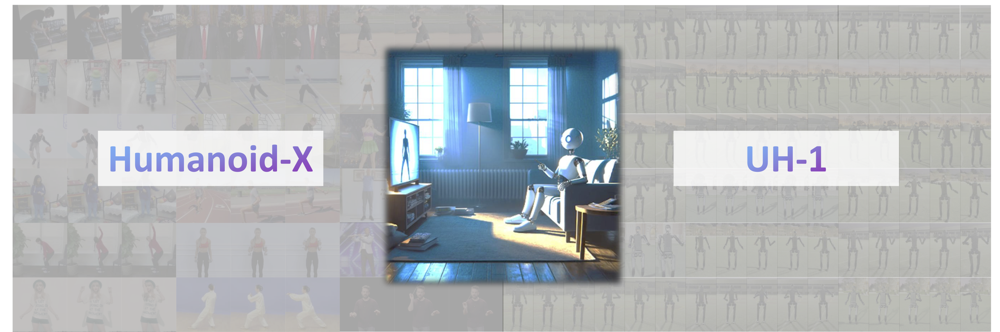

# Learning from Massive Human Videos for Universal Humanoid Pose Control

<p align="left">
    <a href="https://img.shields.io/badge/PRs-Welcome-red">
        
    </a>
    <a href="https://img.shields.io/github/last-commit/xlang-ai/text2reward?color=green">
        
    </a>
    <br/>
</p>
<div align="center">
</img> 
</div>
<h5 align="center">
    <a href="https://usc-gvl.github.io/UH-1/">🌐 Homepage</a> | <a href="https://huggingface.co/datasets/USC-GVL/Humanoid-X">⛁ Dataset</a> | <a href="https://huggingface.co/USC-GVL/UH-1">🤗 Models</a> | <a href="https://arxiv.org/abs/2412.14172">📑 Paper</a> | <a href="https://github.com/sihengz02/UH-1">💻 Code</a>
</h5>

Code for paper [Learning from Massive Human Videos for Universal Humanoid Pose Control](https://arxiv.org/abs/2412.14172). Please refer to our [project page](https://usc-gvl.github.io/UH-1/) for more demonstrations and up-to-date related resources. 


## Dependencies
To establish the environment, run this code in the shell:
```shell
conda create -n UH-1 python=3.8.11
conda activate UH-1
pip install git+https://github.com/openai/CLIP.git
pip install mujoco opencv-python
```


## Usage

### Preparation

Download our model checkpoints from [here](https://huggingface.co/USC-GVL/UH-1).

```bash
git lfs install
git clone https://huggingface.co/USC-GVL/UH-1
```

### Inference

- Change the `root_path` in `inference.py` to the path of the checkpoints you just downloaded.
- Change the `prompt_list` in `inference.py` to the language prompt you what the model to generate.

- Run the following commands, and the generated humanoid motion will be stored in the `output` folder.

```bash
python inference.py
```

### Visualize

- Change the `file_list` in `visualize.py` to the generated humaoid motion file names.
- Run the following commands, and the rendered video will be stored in the `output` folder.

```bash
mjpython visualize.py
```


## Citation

If you find our work helpful, please cite us:

```bibtex
@article{mao2024learning,
  title={Learning from Massive Human Videos for Universal Humanoid Pose Control},
  author={Mao, Jiageng and Zhao, Siheng and Song, Siqi and Shi, Tianheng and Ye, Junjie and Zhang, Mingtong and Geng, Haoran and Malik, Jitendra and Guizilini, Vitor and Wang, Yue},
  journal={arXiv preprint arXiv:2412.14172},
  year={2024}
}
```

